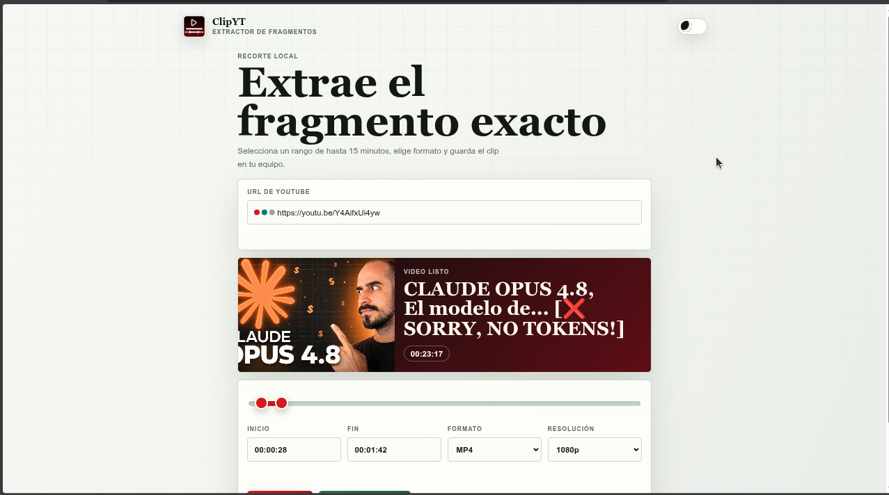
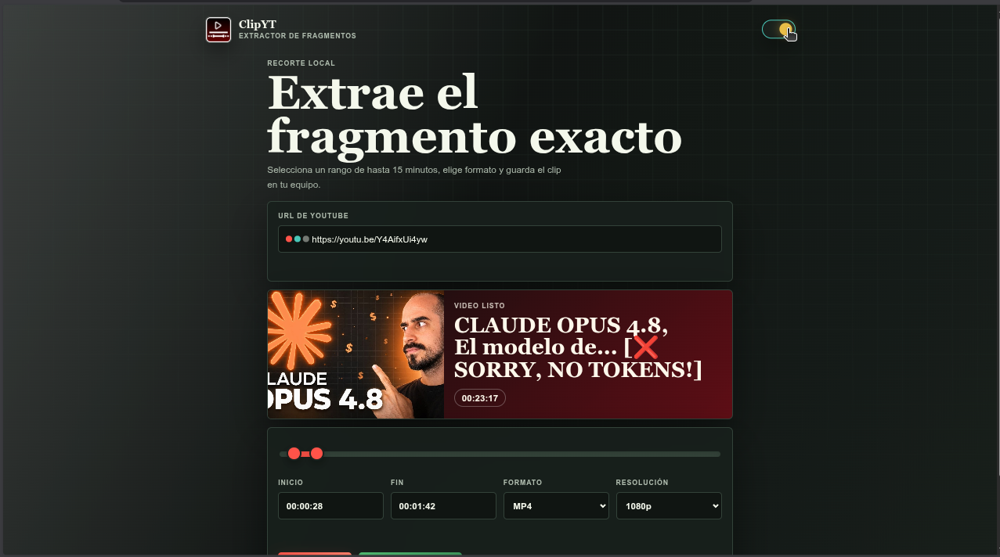

<div align="center">
  
</div>

# Extractor de Fragmentos de YouTube

Una aplicación web local ágil y sencilla diseñada para descargar recortes de videos de YouTube. Solo necesitas pegar la URL del video, seleccionar el rango de tiempo exacto y podrás obtener tu clip en formato MP4 o GIF.

## 🎨 Interfaz (Modo Claro / Oscuro)

La aplicación cuenta con soporte para temas claro y oscuro, adaptándose a las preferencias de tu sistema.

<p align="center">
  
  
</p>

## 🚀 Características
- **Fácil de usar**: Interfaz web intuitiva para interactuar rápidamente.
- **Recortes precisos**: Selecciona el instante exacto de inicio y fin para extraer solo lo que te interesa.
- **Formatos soportados**: Exporta directamente a MP4 (video estándar) o GIF (ideal para memes o animaciones cortas).
- **Integración directa con GIPHY**: Sube tus fragmentos a Giphy con un solo clic, sin descargas previas en tu equipo. Obtén al instante un enlace directo en formato GIF (`https://media.giphy.com/media/{id}/giphy.gif`).
- **Procesamiento Local**: Todo el procesamiento se realiza en tu propia máquina a través de ffmpeg.

## 📋 Requisitos Previos

Asegúrate de tener instalados los siguientes componentes en tu sistema antes de iniciar:
- **Python 3.11** o superior.
- **ffmpeg**: Fundamental para el procesamiento de media (video/audio). Debe estar instalado y accesible en las variables de entorno (PATH) del sistema.

## 🛠️ Instalación

1. Clona este repositorio o descarga el código fuente a tu máquina local.
2. Instala las dependencias necesarias. Puedes hacerlo instalándolas globalmente o en un entorno virtual/vendor:

```bash
python3 -m pip install --target .vendor -r requirements.txt
```

*(Si prefieres usar un entorno virtual estándar, omite el parámetro `--target .vendor`).*

## 💻 Uso

1. Levanta el servidor ejecutando el script principal:

```bash
python3 server.py
```

2. Abre tu navegador web favorito y dirígete a:
`http://127.0.0.1:13200`

3. Pega la URL del video de YouTube.
4. Establece el punto de inicio y el fin del fragmento.
5. Elige el formato deseado (MP4 o GIF).
6. **Descarga local o subida directa**:
   * Si deseas guardar el fragmento en tu máquina, haz clic en **Extraer Clip**.
   * Si prefieres subirlo directamente a Giphy sin descargarlo primero, haz clic en **Subir a GIPHY**, ingresa tus datos en el modal y la aplicación se encargará de extraer el recorte y subirlo de forma transparente en segundo plano.

> **Nota técnica:** Los archivos temporales se guardan localmente en la carpeta `.clip_jobs/` durante su generación. Si realizaste una extracción directa para descarga, el archivo se entregará a través del diálogo normal del navegador. Si subiste directamente a Giphy, se te proporcionará el enlace directo del GIF al finalizar.
